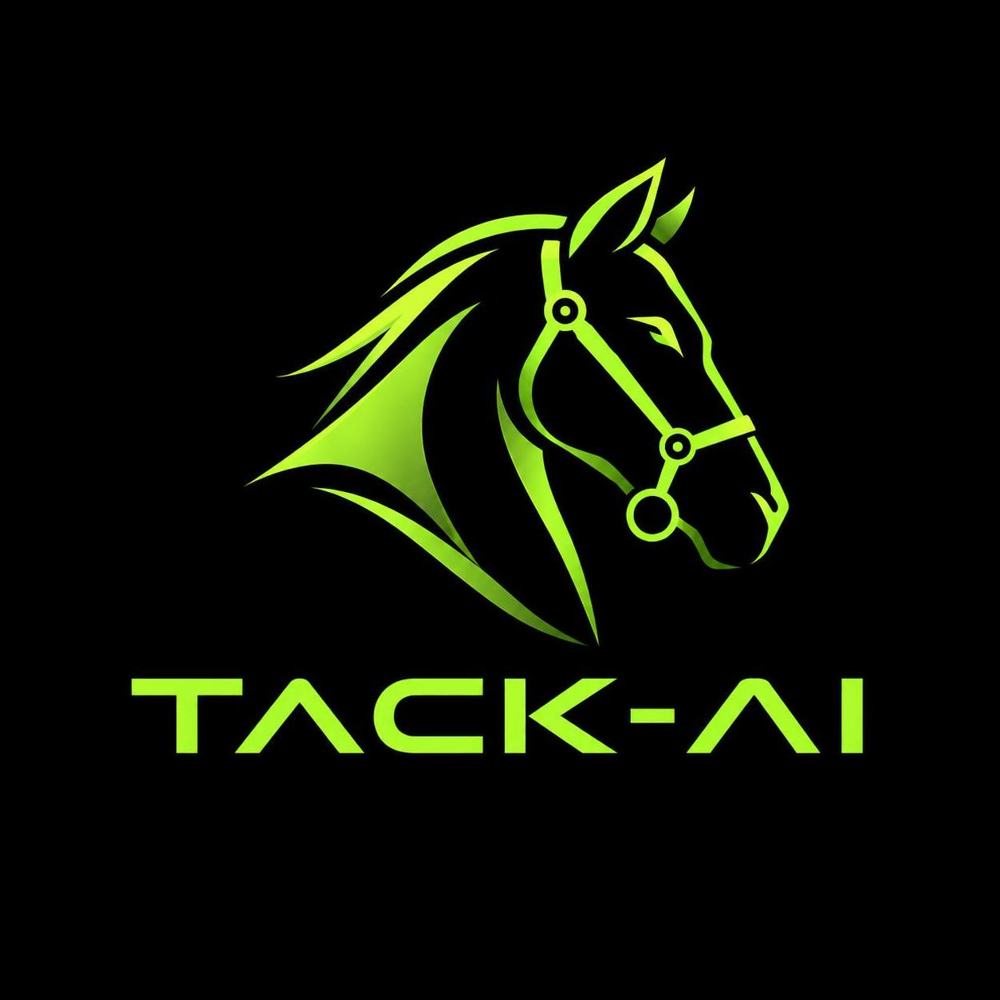

<div align="center">
  <picture>
    <source media="(prefers-color-scheme: dark)"  srcset="templates/img/tack-ai-logo-dark.png">
    <source media="(prefers-color-scheme: light)" srcset="templates/img/tack-ai-logo-light.png">
    
  </picture>

# tack-ai
</div>

A policy-governed coding agent with a tamper-evident audit trail. Designed for compliance-sensitive environments where every tool call must be authorized, every decision must be auditable, and the cost of each run must be tracked and enforced.

## What it does

- **Coding workflow** — autonomous Plan → Edit → Test → Gate loop powered by `pydantic_graph`; four sub-agents collaborate to decompose, implement, and verify tasks with parallel file edits and a structured review gate
- **Routes tasks** to the right model tier (simple / general / deep reasoning) via a configurable LLM or rule-based router; Anthropic and OpenAI are equal first-class providers
- **Enforces policy** with Cedar (default) or OPA — every tool call gets an `allow`, `deny`, or `require_approval` decision before execution; fail-closed by default; swap engines via `POLICY_ENGINE`
- **Audits everything** in a hash-chained, append-only Postgres table with secret redaction
- **Manages memory** through rolling conversation summarization and pgvector-backed semantic search over code and documents
- **Web console** for task queue, human approval, audit export, routing settings, and user management (local accounts + OIDC/SSO)

## Architecture

```
┌─────────────────────────────────────────────────────────────────────┐
│                         Coding Workflow                             │
│                                                                     │
│   PlanNode ──▶ EditNode ──▶ TestNode ──▶ GateNode                  │
│       │          (parallel)                  │                      │
│       └──────────────────────────────────────┘  (on "fix", retry)  │
│                                          Jev / LLM decision         │
└─────────────────────────────────────────────────────────────────────┘
         │ tool calls
         ▼
┌──────────────────┐   allow/deny/require_approval   ┌──────────────────┐
│  Cedar / OPA     │◀───────────────────────────────▶│  Tool Execution  │
│  Policy Engine   │                                 └──────────────────┘
└──────────────────┘
         │                                                │
         ▼                                                ▼
┌──────────────────────┐                    ┌────────────────────────┐
│  Audit Trail         │                    │  Anthropic / OpenAI    │
│  (hash-chained PG)   │                    │  (equal peers)         │
└──────────────────────┘                    └────────────────────────┘
```

**Key components:**

| Component | Technology | Purpose |
|-----------|------------|---------|
| Coding workflow | `pydantic_graph` | Plan → Edit → Test → Gate with up to 3 retry iterations |
| Gate decision | TypeSafe Jev / LLM fallback | Structured fix / escalate / pass decision |
| Chat agent | Pydantic AI | 8 tools, prompt caching, cost tracking |
| Policy engine | Cedar (default), OPA | Cedar: tool authorization; OPA: routing + budget |
| Approval flow | DB queue + web UI | Human-in-the-loop for gray-area decisions |
| Access control | OpenFGA | Fine-grained per-resource permissions |
| Memory | Postgres + pgvector | Conversation history + semantic code/doc search |
| Observability | structlog, Prometheus, OpenTelemetry, Logfire | Traces, metrics, structured logs |
| Durable execution | DBOS | Exactly-once side effects (optional) |

## Quick start

### Prerequisites

- Python 3.12+, [`uv`](https://docs.astral.sh/uv/), Docker
- `ANTHROPIC_API_KEY` or `OPENAI_API_KEY` (at least one required)

### Local development

```bash
# 1. Clone and install deps
git clone https://github.com/SkylarHoughtonGithub/tack-ai && cd tack-ai
uv sync --all-groups

# 2. Configure environment
cp .env.example .env
# edit .env — set at least one API key

# 3. Start infrastructure (Postgres, OPA, OpenFGA)
docker compose up postgres opa openfga -d

# 4. Apply DB migrations
task migrate

# 5. Start the web console
uv run tack-ai-web
# → http://localhost:8000  (default: admin / changeme)

# 6. Or run the agent CLI
uv run python -m tack_ai.agent
```

### Docker (full stack)

```bash
cp .env.example .env  # set API keys
docker compose up
# → http://localhost:8000
```

### Run the coding workflow

```bash
./scripts/smoke_graph.sh   # end-to-end Plan → Edit → Test → Gate smoke test
```

## Configuration

| Variable | Required | Description |
|----------|----------|-------------|
| `ANTHROPIC_API_KEY` | One of these | Anthropic model access |
| `OPENAI_API_KEY` | One of these | OpenAI model access |
| `TYPESAFE_API_KEY` | No | TypeSafe Jev key — enables structured gate decisions (falls back to LLM if absent or invalid) |
| `DATABASE_URL` | No | Postgres connection string; enables user DB, audit trail, and memory |
| `OPENFGA_URL` | No | OpenFGA server URL for fine-grained access control |
| `WEB_USERNAME` / `WEB_PASSWORD` | No | Override default `admin` / `changeme` credentials |
| `OIDC_PROVIDER` | No | `google`, `github`, or `oidc` for SSO login |
| `OIDC_CLIENT_ID` / `OIDC_CLIENT_SECRET` | If OIDC | OAuth application credentials |
| `OIDC_ADMIN_EMAILS` | No | Comma-separated emails granted admin role via OIDC |
| `POLICY_ENGINE` | No | `cedar` (default) or `opa` — Cedar handles tool-auth; routing/budget always via OPA |
| `OPA_URL` | No | OPA server URL (default `http://localhost:8181`) |
| `LOGFIRE_TOKEN` | No | Pydantic Logfire token for AI observability |
| `LOG_JSON` | No | `true` for JSON logs (default), `false` for human-readable |

## Commands

```bash
uv run tack-ai-web              # web console (preferred over uvicorn --reload)
uv run python -m tack_ai.agent  # CLI chat agent

uv run pytest tests/ -v --ignore=tests/e2e  # unit tests (no external services needed)
uv run ruff check src/          # lint
uv run mypy src/tack_ai/        # type-check
uv run bandit -r src/tack_ai/ -ll  # security scan

# Task runner shortcuts (requires https://taskfile.dev)
task dev      # starts all infrastructure + web console
task opa      # OPA policy server with --watch
task migrate  # apply all DB migrations in order
task test     # run test suite
task lint     # ruff + mypy + bandit
```

## Coding workflow

The `pydantic_graph` workflow (`src/tack_ai/graph/`) runs four sub-agents in sequence:

| Node | Agent | Role |
|------|-------|------|
| `PlanNode` | `planner_agent` | Decomposes the task into per-file edit steps |
| `EditNode` | `edit_agent` | Applies edits in parallel; reads/writes files, searches the code index |
| `TestNode` | `test_agent` | Runs the project test suite and produces a structured result |
| `GateNode` | `review_agent` + Jev | Decides `pass`, `fix` (retry up to 3×), or `escalate` to a human |

Every tool call in every sub-agent is gated by the configured policy engine (Cedar by default). The gate uses [TypeSafe Jev](https://jev-agent.com) for a deterministic structured decision when `TYPESAFE_API_KEY` is set, with an LLM fallback for tool calls Jev cannot fill.

```python
from tack_ai.graph.workflow import run_coding_task
from tack_ai.core.config import Settings

result = await run_coding_task(
    "Add type annotations to src/tack_ai/core/router.py",
    settings=Settings(),
    budget_usd=1.00,
)
```

## Agent tools

The chat agent has 8 tools, each gated by the policy engine before execution:

| Tool | Risk | Approval required |
|------|------|-------------------|
| `web_search` | Low | No |
| `read_file` | Low | No |
| `search_documents` | Low | No |
| `search_code_chunks` | Low | No |
| `draft_email` | Medium | No (requires approval if immediately after `read_file`) |
| `write_file` | Medium | Yes for paths outside `drafts/` |
| `run_code` | High | Yes |
| `run_tests` | Medium | No |
| `send_email` | High | Yes |
| `delete_file` | High | Always denied |

See [`docs/AGENTS.md`](docs/AGENTS.md) for the full policy reference.

## Policies

Policy files live in `policies/`:

| File | Engine | Governs |
|------|--------|---------|
| `tool_policy.cedar` | Cedar | Tool authorization (default engine) |
| `tools.rego` | OPA | Tool authorization (when `POLICY_ENGINE=opa`) |
| `tools.rego` | OPA | Routing decisions + budget enforcement (always) |

Cedar is deny-by-default — any tool without a permit rule is blocked structurally. OPA handles routing and budget rules that Cedar cannot express.

OPA policies auto-reload on file change (`--watch`). With Docker Compose the OPA container starts automatically; locally: `task opa`.

## Evals

```bash
uv run python evals/run_redteam_evals.py   # injection/exfiltration scenarios (no LLM cost)
uv run python evals/run_router_evals.py    # router accuracy on 40 golden cases
uv run python evals/run_answer_evals.py    # LLM-as-judge answer quality (Haiku vs gpt-4o-mini)
```
